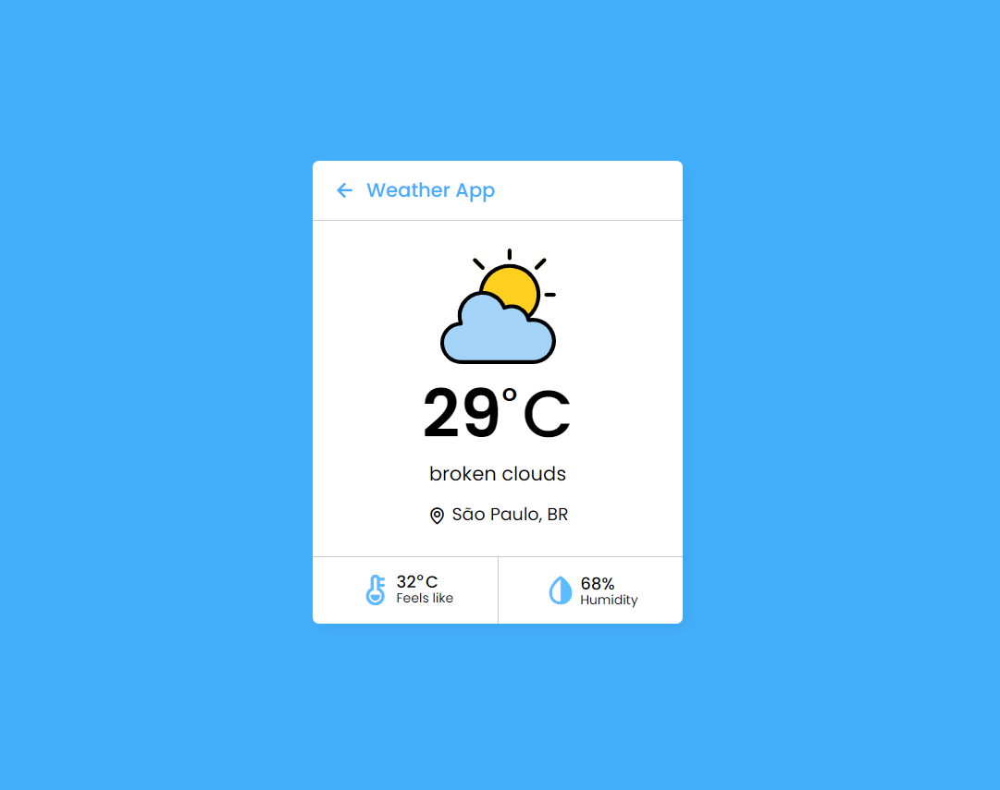

<div align="center">
  <h1>Weather App</h1>
  <p>Aplicação para realizar consulta de clima, com base na inserção manual da cidade ou geolocalização do dispositivo.</p>
  
</div>

# 📒 Índice
* [Descrição](#descrição)
* [Requisitos Funcionais](#requisitos)
* [Tecnologias](#tecnologias)
* [Design](#design)
  * [Cores](#cores)
  * [Fontes](#fontes)
  * [Ícones](#ícones)
* [Instalação](#instalação)
* [Licença](#licença)

# 📃 <span id="descrição">Descrição</span>
Aplicação desenvolvida utilizando a API da Open Weather, para realizar consulta de clima, utilizando a fetch API para requisições e respostas, com base na inserção manual da cidade ou geolocalização do dispositivo.

# 📌 <span id="requisitos">Requisitos Funcionais</span>
- [x] Requisição a API Open Weather<br>
- [x] Consulta por inserção de cidade<br>
- [x] Validação da inserção de dados<br>
- [x] Consulta por geolocalização<br>

# 💻 <span id="tecnologias">Tecnologias</span>
- **HTML**
- **CSS**
- **JavaScript**

# 🎨 <span id="design">Design</span>
- O modelo final para versão desktop e mobile está disponível na pasta `./design`

- <span id="cores">Cores<br></span>
  * #43AFFC<br>
  * #fff<br>
  * #721c24<br>
  * #f8d7da<br>

- <span id="fontes">Fontes<br></span>
  * Poppins, sans-serif

- <span id="ícones">Ícones<br></span>
  * Boxicons

# 🚀 <span id="instalação">Instalação</span>
```bash
  # Clone este repositório:
  $ git clone https://github.com/CleilsonAndrade/Busca_Git
  $ cd ./Busca_Git
```

# 📝 <span id="licença">Licença</span>
Esse projeto está sob a licença MIT. Veja o arquivo [LICENSE](LICENSE) para mais detalhes.

---

<p align="center">
  Feito com 💜 by CleilsonAndrade
</p>